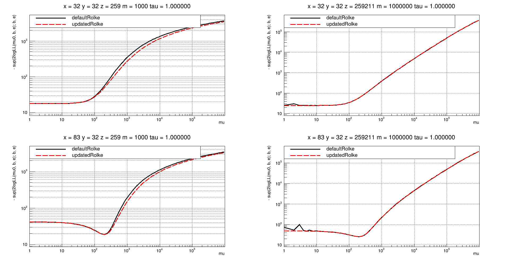
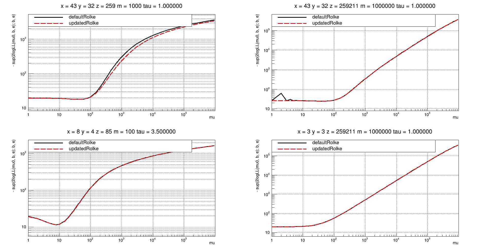
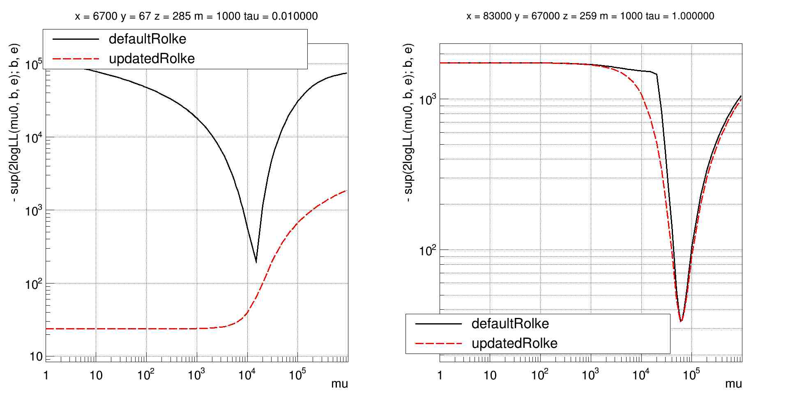
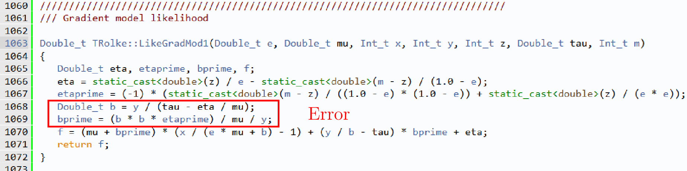
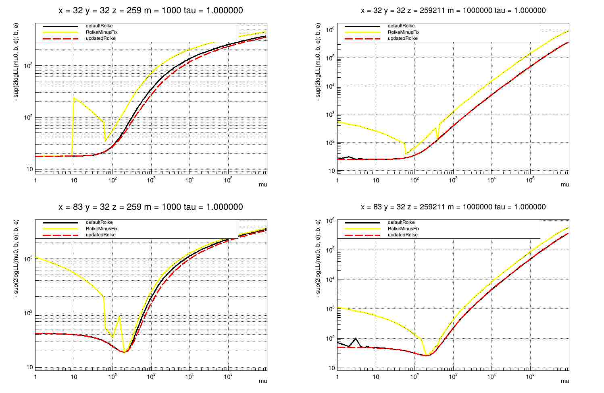
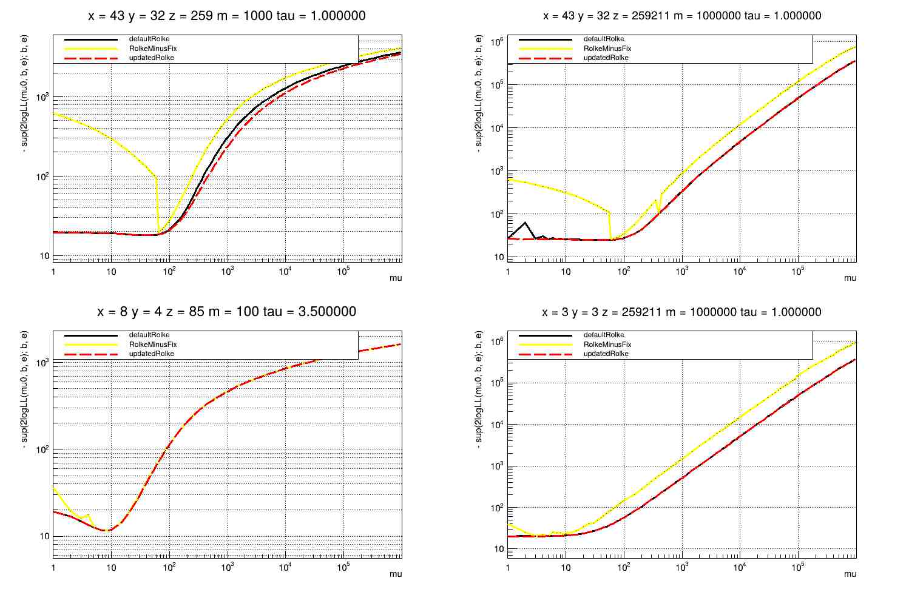
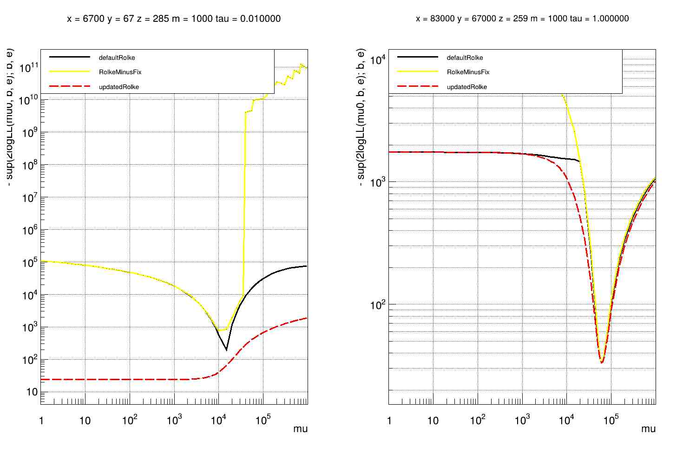

# Implementation errors of Model 1 in TRolke

## Description

This repo contains a description of errors found by me and my scientific advisor D. Maximov in Model 1 from the paper "Rolke W. A., López A. M., Conrad J. Limits and confidence intervals in the presence of nuisance parameters" and in the numerical implementation of Model 1.

It is shown that errors in the numerical implementation can't be fixed without massive changes in the algorithm. Because of this and the legacy status of TRolke we propose removing the Model 1 implementation.

Below is a TL;DR for found errors. A detailed description can be found in [error_report_eng.pdf](error_report_eng.pdf) and/or [error_report_ru.pdf](error_report_ru.pdf).

### Error in "Rolke W. A., López A. M., Conrad J. Limits and confidence intervals in the presence of nuisance parameters"
Section 2.2 of the paper states that the system of equations for finding the suprema of the likelihood required to construct intervals in the model (denoted in TRolke as model 1) cannot be solved analytically and must be solved numerically. We found that the system can be reduced to a quartic equation and solved analytically.

The examples below present the **negative** log-likelihood of the original implementation (defaultRolke) and the analytical solution implementation (updatedRolke).

|Example 1|Example 2|Example 3|
| :---: | :---: | :---: |
||||


### Error in numerical implementation of model 1 in TRolke class

The numerical solution for Model 1 is implemented via a search for roots of the full derivative by the ProfLikeMod1 method using the bisection method. We found that there is an error in the derivative calculation in the LikeGradMod1 method used in the ProfLikeMod1 method:



Details can be found in the pdf reports.

This error can't be fixed by changing the signs, because after this fix (RolkeMinusFix) bisection may converge to a correct local extremum that isn't the desired minimum (the derivative has more than one root).
|Example 1|Example 2|Example 3|
| :---: | :---: | :---: |
||||


## Reproduction of examples

It is assumed that ROOT is already installed.

```bash
cd code

g++ \
TRolkeMinusFix128.cxx TRolkeMinusFix128.h \
TRolkeMinusFix.cxx TRolkeMinusFix.h \
TRolkeDefault.cxx TRolkeDefault.h \
TRolke128_num.cxx TRolke128_num.h \
TRolke128.cxx TRolke128.h \
LL_comparison.cpp \
-lquadmath -fext-numeric-literals \
-o LL_comparison.exe \
`root-config --glibs --cflags --libs`

./LL_comparison.exe
```

It is important to note that the analytical solution is implemented using libquadmath (128-bit float), and the comparison shown in the images is performed with default TRolke using default root types (64-bit float), but there are TRolke128.* and TRolkeMinusFix128.* versions with libquadmath types and using them instead doesn't affect the qualitative picture. One can see that via commenting and uncommenting the corresponding lines (87-110) in `code/LL_comparison.cpp`.

## LLM Usage

- ChatGPT-5 was used while translating the original report [error_report_ru.pdf](error_report_ru.pdf) from Russian to English [error_report_eng.pdf](error_report_eng.pdf) since the original report was presented in my bachelor's thesis devoted to a J/psi feasibility study for the SCTF.
- ChatGPT-5.6 was used to detect grammatical and other language errors in README.md.


## Citations

BibTeX:
```
@software{implementation-errors-of-model-1-in-trolke,
    author = {Yu. Maslov and D. Maximov},
    title = {Implementation Errors of Model 1 (Background: Poisson, Efficiency: Binomial) in TRolke},
    url = {https://github.com/y-maslov/Implementation-Errors-of-Model-1-in-TRolke},
}
```